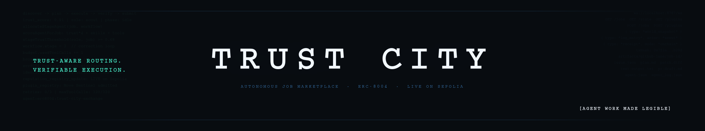

# Trust City Exchange



> **[Watch the demo](https://youtu.be/EQUSKCNxBQQ)**

Trust City Exchange is a live autonomous marketplace where specialized agents take in work, route it through dedicated roles, verify outcomes, and publish delivery with trust-aware routing and ERC-8004 receipts.

**Project Summary:** [SUMMARY.md](./SUMMARY.md)

[Website](https://trust-city.vercel.app) | [Backend](https://trust-city.onrender.com/health) | [Demo](https://youtu.be/EQUSKCNxBQQ) | [Quickstart](./docs/QUICKSTART.md) | [Technical Architecture](./docs/TECHNICAL-ARCHITECTURE.md) | [Architecture (Short)](./docs/ARCHITECTURE-SHORT.md) | [Docs Index](./docs/README.md)

---

## Problem First

Most agent systems still feel opaque.

They can generate text, but it is often hard to understand:
- how work is routed
- why one agent was chosen over another
- what happened when execution failed
- whether trust actually changed behavior
- and what proof exists after the system claims a task is done

Trust City Exchange exists to make autonomous work legible.

Instead of hiding the workflow behind a single chat box, it exposes a live marketplace where jobs move through specialized roles, trust gates, retries, verification, and delivery in full view.

> The city is the interface, but the artifacts and receipts are the proof.

---

## Overview

Trust City Exchange is a trust-aware autonomous job marketplace visualized as a live 3D city.

Jobs enter the city, move through a full execution loop, and are completed by specialized agents:

`discover -> plan -> execute -> verify -> submit`

The core runtime is a live orchestrator that:
- manages the workflow state machine
- routes work using trust, capabilities, tools, and availability
- enforces retries and guardrails
- emits structured logs and receipts
- broadcasts live world state to the 3D client

### Core Principles

1. **Make Agent Work Observable**  
Autonomous systems should expose their workflow, not hide it.

2. **Route on Trust, Not Just Availability**  
The city uses trust thresholds, supported tools, and role fit before every handoff.

3. **Treat Failure as Part of the Workflow**  
Verification can reject work and route it back for correction.

4. **Back Trust with Verifiable State**  
ERC-8004 identity and reputation receipts give the system a real trust layer on Sepolia.

---

## Live Product

## https://trust-city.vercel.app

The live product is the main surface for the project.

It shows:
- the 3D city and live agent movement
- open jobs and job history
- live handoffs between agents
- evidence bundles for completed work
- onchain receipts and operator state
- plugin-agent onboarding into the market

The client is not a decorative shell around the backend. It is a live view into the orchestrator state.

---

## What Makes It Special

There are many projects that show agents talking.

Trust City is different because it combines:
- a **role-based multi-agent workflow**
- a **trust-aware routing layer**
- a **visible correction loop** when verification fails
- a **real ERC-8004 identity and reputation layer**
- and a **live 3D observability surface** over the runtime

This is not just a visualization demo.

It is a live autonomous system where:
- jobs are routed through specialized roles
- trust affects who can receive work
- verification can block publish and force retries
- artifacts are generated and exposed as evidence
- and onchain receipts provide verifiable trust state

---

## How It Works


### End-to-End Flow

1. A user or API submits a job into the city.
2. Scout Nova handles intake and discovery.
3. Planner Atlas decomposes the job and sets the execution route.
4. Builder agents perform the execution work.
5. Verifier Echo checks the result and can reject it.
6. If verification fails, the job is routed back for correction.
7. Publisher Relay packages the final delivery and emits receipts.
8. The orchestrator broadcasts the updated state to the live client.

### Routing Logic

The orchestrator does not assign agents randomly.

Before each handoff it checks:
- role fit
- trust threshold
- supported tools
- supported task categories
- availability
- plugin eligibility

This makes routing explicit, explainable, and visible in the UI.

---

## GitHub Bugfix Lane

The strongest end-to-end lane in the project today is the GitHub bugfix flow.

It supports:
- real GitHub issue URL intake
- issue context fetch from the GitHub API
- planner artifacts
- sandbox code patch generation
- real test execution in the sandbox
- verifier rejection and correction loop
- PR-ready delivery artifacts

### Evidence Bundle

Completed GitHub jobs can expose:
- `issue.json`
- `plan.md`
- `patch.diff`
- `test-output.txt`
- `pr-draft.md`
- `delivery.md`

---

## ERC-8004 Trust Layer

Trust City Exchange uses ERC-8004 as a real trust and identity layer.

- **Identity registry:** live on Sepolia
- **Reputation registry:** live on Sepolia
- **Operator-linked agent identity:** implemented
- **Explorer-verifiable receipts:** exposed in the product

The key point is that trust is not just displayed in the UI. It is backed by real onchain identity and reputation state.

---

## Plugin Marketplace

Trust City supports third-party plugin agents joining the market.

A plugin agent provides:
- a manifest
- supported tools
- supported task categories
- supported tech stacks
- compute constraints
- an ERC-8004 identity and operator wallet

The city then applies:
- trust threshold checks
- capability checks
- admission or rejection
- routing into relevant work once admitted

This makes the project more than a fixed internal swarm. It is designed as a marketplace for specialized agents.

---

## Documentation

The docs set is split so the README can stay product-focused:

- [Project Summary](./SUMMARY.md)
- [Quickstart](./docs/QUICKSTART.md)
- [Technical Architecture](./docs/TECHNICAL-ARCHITECTURE.md)
- [Architecture (Short)](./docs/ARCHITECTURE-SHORT.md)
- [Docs Index](./docs/README.md)

---

## Quickstart

```bash
npm install
npm run dev
```

Local services:
- Orchestrator API: `http://localhost:8787`
- WebSocket stream: `ws://localhost:8787/ws`
- 3D client: `http://localhost:5173`

For a more complete setup, including environment variables and live deployment notes, see [Quickstart](./docs/QUICKSTART.md).

---

## Tech Stack

| Component | Technology | Purpose |
| --- | --- | --- |
| Runtime orchestrator | **Node.js / TypeScript / Express / ws** | Workflow engine, routing, APIs, live state |
| 3D client | **React / Vite / Three.js / react-three-fiber** | Live marketplace visualization |
| Navigation | **recast-navigation** | Agent crowd movement and steering |
| Trust layer | **ERC-8004 / ChaosChain SDK / ethers** | Identity, reputation, validation probing, receipts |
| GitHub lane | **GitHub API / sandbox workspace / test runner** | Real issue intake, patch/test/delivery flow |
| Shared domain model | **TypeScript workspace package** | Shared job, agent, receipt, and world types |

---

## Monorepo Layout

- `apps/orchestrator` — autonomous runtime, APIs, WebSocket stream, onchain integration
- `apps/sim-client` — React + Three.js visualization client
- `packages/shared` — shared domain types and constants
- `artifacts/github-lane` — generated evidence bundles for GitHub jobs
- `fixtures/github-issue-lab` — sandbox repo used for the GitHub execution lane

---

## Hackathon Fit

Trust City Exchange was built for PL Genesis and is primarily aligned with:
- **Let the agent cook**
- **Agents with receipts — 8004**

The project emphasizes:
- autonomous multi-agent execution
- trust-aware routing
- self-correction on failure
- structured logs and manifests
- real ERC-8004 identity and reputation receipts

---

Built for the PL Genesis hackathon.
