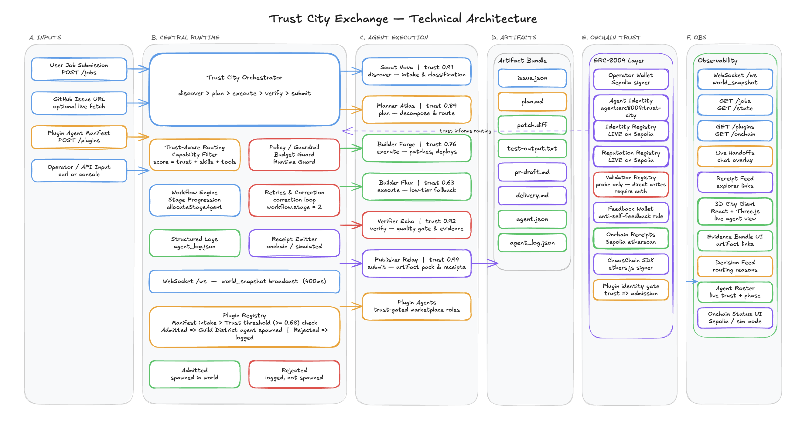

# Technical Architecture

## Overview

Trust City Exchange is built as a live orchestrated runtime with a separate observability client.

The core architecture is:

`Inputs -> Orchestrator -> Specialized Agents -> Verification / Delivery -> Receipts / Artifacts -> Live Client`

## 1. Inputs

The system currently accepts work through:
- manual job submission
- GitHub issue URL intake for the bugfix lane
- plugin agent manifest registration
- operator/API job injection

These inputs enter the orchestrator through HTTP endpoints and are normalized into a common job format.

## 2. Central Orchestrator

The orchestrator is the runtime brain of the system.

It owns:
- the job state machine
- stage allocation
- trust-aware routing
- capability and tool filtering
- retries and correction loop
- compute budget awareness
- structured logs
- receipt emission
- world snapshot broadcasting over WebSocket

The core workflow is:

`discover -> plan -> execute -> verify -> submit`

## 3. Specialized Agent Roles

The runtime uses specialized roles rather than one generic agent.

### Scout Nova
- intake
- discovery
- initial job classification

### Planner Atlas
- decomposition
- route planning
- skill / trust / tool framing

### Builder Forge / Builder Flux
- execution
- patching or build work
- tool usage

### Verifier Echo
- quality gate
- evidence review
- retry trigger when work fails validation

### Publisher Relay
- final artifact packaging
- receipt-oriented publish step

## 4. Trust-Aware Routing

Agent routing is not random.

Before each handoff, the orchestrator checks:
- trust threshold
- supported task category
- supported tools
- agent role fit
- agent availability
- plugin eligibility

This is one of the project’s core technical claims: trust directly affects runtime behavior.

## 5. GitHub Bugfix Lane

The GitHub lane is currently the strongest fully demonstrated end-to-end path.

### Current flow
1. ingest a GitHub issue URL
2. fetch issue context from GitHub when available
3. write planning artifacts
4. execute inside a sandbox workspace
5. run tests in the sandbox
6. reject / retry on failed verification
7. package PR-ready delivery artifacts

### Artifacts
- `issue.json`
- `plan.md`
- `patch.diff`
- `test-output.txt`
- `pr-draft.md`
- `delivery.md`

### Important note
This lane is currently **sandbox-real**:
- the issue context is real
- patch and test execution are real
- the system produces a PR-ready bundle
- but it does not yet push a real upstream branch or open a live PR against the source repository

## 6. ERC-8004 Layer

Trust City Exchange uses ERC-8004 as a real trust layer.

### Identity
- operator-linked identity is registered on Sepolia

### Reputation
- reputation receipts are written on Sepolia
- explorer-verifiable transactions are surfaced in the product

### Validation
- validation probing is implemented
- direct writes are conditional / auth-gated based on the current registry flow

The purpose of this layer is to ensure that trust is not only visualized, but backed by onchain state.

## 7. Plugin Agent Architecture

Third-party agents can join through a manifest-based registration flow.

Plugin agent registration includes:
- supported tools
- supported categories
- supported tech stacks
- compute constraints
- operator wallet
- ERC-8004 identity

Admission is gated by:
- trust threshold
- capability fit
- category support

Admitted plugin agents can then enter the routing pool.

## 8. Observability Client

The React + Three.js client subscribes to world state over WebSocket and visualizes:
- agent movement
- live handoffs
- open jobs and history
- evidence bundles
- receipts
- runtime metrics

The client is intentionally designed as an observability surface for the runtime, not just a static dashboard.

## 9. Manifest and Logs

The project exports:
- [`agent.json`](../agent.json)
- [`agent_log.json`](../agent_log.json)

These provide:
- capability manifest
- structured execution history
- hackathon compatibility

## Placeholder Images

Suggested image slots for later:
- `../images/trust-city-technical-architecture.png`
- `../images/trust-city-readme-flow.png`
- `../images/trust-city-readme-trust.png`
